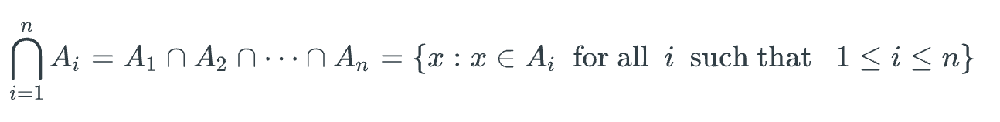
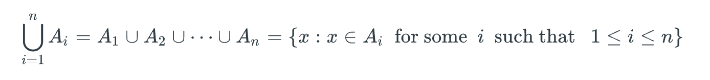

## Module 5.1 - Branching Statements Part 1

Let's start with a program that reads an int from stdin and returns the absolute value to stdout. Well, depending on the user input we need to do different things. Did the user send a positive? Negative? Our current understanding of the world is **sequential flow** or executing lines of code in the order we see them. In order to get more granularity we'll need **branching flow**, where we have different cases to execute based on some **predicates**.

We'll introduce the **if-statement** for control. A **one-way** if-statement is the most basic. Introducing the syntactic rules:

```cpp
// code goes here
if (CONDITION) {
  // consequent code goes here.
  // often called the body
}

// more code
```

Now let's consider implementing absolute value with conditionals.

```cpp
#include <iostream>
using namespace std;

int main() {
	cout << "Please input an integer" << endl;
	int input;
	cin >> input;

	if (input < 0) {
		input *= -1;
	}

	cout << "Your absolute value is: " << input << endl;
	return 0;
}
```

C++ supports arithmetic operation and assignment with the shorthand `variable *= operand` where the variable will be multiplied (we can use addition, division, etc) by the operand and reassigned.

We use curly braces after the condition to group together a set of statements.

Let's try another example. Let's determine if an input integer is even or odd. We have the one-way if statement but a **two-way** if-statement would be more powerful, using `if-else` commonly known as the **Condition-Consequent-Alternative** model  - [wiki](https://en.wikipedia.org/wiki/Conditional_(computer_programming).

```cpp
#include <iostream>
using namespace std;

int main() {
	cout << "Please input a positive integer" << endl;
	int input;
	cin >> input;

	if (input % 2 == 0) {
		cout >> "Your input is even" << endl;
	} else {
		cout >> "Your input is odd" << endl;
	}

	return 0;
}
```

We could also have done this with two independent one-way ifs, since mod-2 is a boolean domain.

```cpp
// SNIPPED
	if (input % 2 == 0) {
		cout >> "Your input is even" << endl;
	}
	if (input % 2 == 1) {
		cout >> "Your input is odd" << endl;
	}

// SNIPPED
```

The two-way syntax makes it very obvious that only one of two conditions can run at the same time. However, if we had some complex multi-branch logic or a possibility that both states run (number is even AND number is positive?) then it's possible to *fall through* into multiple ifs.

If the condition is not explicitly true or false (ex `if (val = 0)` assignment), C++ will **cast** to boolean. In this case, `val = 0` returns 0, which is cast to false.

## Module 5.1 - Branching Statements Part 2

Now that we have some logic, we can write a program that takes an input character and classifies it as a lower case, upper case, digit, or non-alphanumeric. Before looking at the video, I decided to try it with direct character comparison rather than ASCII code conversions.

```cpp
#include <iostream>
using namespace std;

int main() {
	char input;
	cout << "Please input a single character" << endl;
	cin >> input;

	if (input >= 'A' && input <= 'Z') {
		cout >> input >> " is an upper case" << endl;
	} else if (input >= 'a' && input <= 'z') {
		cout >> input >> " is a lower case" << endl;
	} else if (input >= '0' && input <= '9') {
		cout >> input >> " is a digit" << endl;
	} else {
		cout >> input >> " is non-alphanumeric" << endl;
	}

	return 0;
}
```

How about converting 24-hour time to 20-hour time?

```cpp
#include <iostream>
#include <string>
using namespace std;

int main() {
	int hours;
	int minutes;
	string period;
	int hourConverted, minuteConverted;
	char tmp;

	cout << "Input a 24 hour time" << endl;
	cin >> hours >> tmp >> minutes;

	minuteConverted = minutes;
	if (hours >= 0 && hours <= 11 ) {
		period = "am";
		if (hours == 0) {
			hourConverted = 12;
		} else {
			hourConverted = hours;
		}
	} else {
		period = "pm";
		if (hours == 12) {
			hourConverted = 12;
		} else {
			hourConverted = hours - 12;
		}
	}

	cout << "The time is: " <<hourConverted << ":" << minuteConverted;
	return 0;
}

```

We've now introduced the **multi-way if**. We have another way to handle this, the **switch statement**. A switch condition is a numeric expression, and each branch is a `case` that matches a constant and executes some code. Each branch must end with a `break` to avoid falling through.

Now let's read a mathematic expression (basic operators) nd return the value. Input is `arg op arg`.

```cpp
#include <iostream>
using namespace std;

int main() {
	double arg1, arg2;
	char operator;

	cout << "Please enter an integer, operator and integer separated by spaces" << endl;

	cin >> arg1 >> operator >> arg2;

	switch(operator) {
		case '*':
			cout << arg1 * arg2 << endl;
			break;
		case '+':
			cout << arg1 + arg2 << endl;
			break;
		case '-':
			cout << arg1 - arg2 << endl;
			break;
		case '/':
			if (arg2 != 0) {
				cout << arg1 / arg2 << endl;
			} else {
				cout << 'Invalid divisor' << endl;
			}

			break;
		default:
			cout << "Error: invalid operator" << endl;
			break;
	}

	return 0;
}
```

A switch statement is considered to be less powerful than multi-way if statements (only can evaluate one condition). Also the condition must be of type int, char or bool. We also need that default branch, or more accurately if we don't have a default branch then nothing happens.

## Problem Solving with C++ - Section 2.4

The order of execution of a program is often called the **flow of control**. We need some language to tell a computer to choose one of two alternatives based on some input. For example, how much do we pay a worker? Well, if they worked overtime we pay 1.5 times their rate for overtime. Else, we pay the standard rate. C++ affords us this logic with the **if-statement**.  The structure of the statement is the **Boolean Expression**, the **Yes Statement** and the optional **No Statement** (ex if this thing is true, do the yes, optionally if it's not true do the no).

Sometimes our boolean expression needs to be semi-complex, or based on multiple predicates (I can hire this person if they're 18 or older AND either has job experience OR has a good referral). We can join these predicates with boolean operators like && or || to return a single boolean value.

A boolean can also be negated with a ! sign (ex I can hire this person if they are not under 18).

Note that comparisons are **binary expressions**, that is, they operator on two values, so the statement `if (18 <= employeeAge < dead)` is invalid. We would need two comparisons joined by &&. The book skips over why but the tldr is is parsing and compilation, where we'll go from `if (18 <= employeeAge < dead)` to `if (true < dead)` because we'll have to evaluate step by step.

## Problem Solving with C++ - Section 3.2

When a program chooses from a number of options, we call this a **branching mechanism**. The if-else statement is an introductory one, but there are others. We have **nested statements** which look like

```cpp
	if (this happens) {
		if (something else is true) {
			// do a thing
		} else {
			// do another thing
		}
	} else {
		//body
	}

```

The book has some gotchas around no braces and indenting nested ifs. Just add the damn braces. It's free.

We also have **switch statements** which will sequentially evaluate branches (called **cases**) and potentially fall through multiple branches unless you `break` out.

```cpp
switch (grade) {
	case 'A':
		// do a thing
		break;
	case 'B':
		// do a thing
		break;
	default:
		// for everyone else
		break;
}
```

The choice of which branch runs is determined by a **controlling expression** (the condition in the parentheses). Each case has  **label** which must be a constant (a literal, or a predefined `const`). That means we cannot do this

```cpp
// INVALID!!!
switch (age) {
	case age < 18:
		// no job for you friend
		break;
	default:
		// hiring you
		break;
}
```

We CAN have fall throughs on purpose by skipping breaks

```cpp
switch (grade) {
	case 'A':
	case 'a':
		// do a thing
		break;

	case 'B':
	case 'b':
		// do a thing
		break;
	default:
		// for everyone else
		break;
}
```

When we create if-else statements (or even switches) we can use **blocks**, which are blobs of code bounded by curly braces. This allows us **local variables**, or the ability to define something that doesn't exist outside of the curlies. We call this **block scope**. We will refer to these blocks as **statement blocks** to separate them from functions.


## Discrete Math Section 3.1

A **set** is a collection of objects. The objects in a set are called **elements** (just like domains). A set does not need to be all of the same type, ex a set could be the set of a strawberry, the number 2, and a monkey.

When a set is small, we can use **roster notation** to define a set as the elements separated by commas and wrapped in curly braces

ex A = {2, 4, 6, 8, 10}

Order is unimportant in sets.

We have two symbols to determine if an element is a member of a set.

* ∈ is the symbol to indicate presence, ex 2 ∈ A
* ∉ is the symbol to indicate no presence, ex 5 ∉ A

We can also use variables to indicate that some variable x is a member of a set. So if we say a ∈ A, we're telling the reader "a is a value that exists in set A, but it could be any of them".

Sometimes it's unwieldy to use roster notation to indicate all elements of a set. If that's the case, we show enough elements to indicate a pattern, then ellipsis, then the last value. For example, if I said "Let A be the set of all numbers from 1 to 100" we could write A = {1, 3, 5, ..., 99}

We can also have an **infinite set** rather than a **finite set**, and we indicate the infinite set without an ending element (because...it's infinite). So if we say "Let C be the set of all positive multiples of 3" we could write C = {3, 6,  9, 12, ...}

If a set has no elements, we call it the **empty set** and write it as ∅. We can also call it the **null set** and indicate with empty braces {}. Since an empty set has no elements, for any a, a ∈ ∅ is true.

We have the idea of **cardinality** which is the size of a finite set. We denote the cardinality of a set as |A|. So for example for A = {1, 3, 5, 7}, |A| = 4. The cardinality of the empty set is zero.

Two sets are the same if and only if they have the exact same elements (remember, order doesn't matter).

#### Common mathematical sets

| Set | Symbol |  Example |
|-----|--------|-----------|
| **N** is the set of **natural numbers**, which includes all integers greater than or equal to 0.	 | **N** | 0, 1, 2, …|
| **Z** is the set of all integers | **Z** | …, -2, -1, 0, 1, 2, … |
| **Q** is the set of **rational numbers**, which includes all real numbers that can be expressed as a/b, where a and b are integers and b ≠ 0.	 | **Q** | 0, 1/2, 5.23, -5/3 |
| **R** is the set of real numbers. | **R** | 0, 1/2, 5.23, -5/3, π, sqrt(2) |


We can use **superscripts** to denote the positive or negative elements of a set. For example, the set R+ is the set of all positive real numbers. The set Z- is the set of all negative integers. Since 0 is neither positive nor negative, these superscripts exclude 0.

We have another notation called **set builder notation** that basically says "This set is all the elements of another set that pass a predicate." In practice this looks something like

A = { x ∈ S : P(x) }

Put another way A is the set of elements of all x in S such that P(X)

S is often one of our mathematical sets. So we might way to say something like "all the integers such that x is in between 0 and 100 and is prime", or

C = { x ∈ Z : 0 < x < 100 and x is prime}

The **universal set** usually denoted by the variable U is the set that contains all elements mentioned in a particular context. For example, if we're having a conversation about grades in the Bridge, we can assume the universal set is the set of all students in the bridge.

When we visualize sets, a **Venn diagram** is useful. We can define the universal set as a box outside, then sets inside as circles (with or without overlaps) and even write sample elements in or out of the sets.

If every element of A is an element of B, we call A a **subset** of B (the students of the Bridge in NY are a subset of the students in the Bridge). We denote this as A ⊆ B.

If at least one element in A is not a member of B, we can say A is not a subset of B. We can denote this as A ⊈ B.

We can chain these operations, to express something like "The empty set is a subset of A and A is a subset of the universal set" as ∅ ⊆ A ⊆ U

If two sets are subsets of each other they must be equal (that is, every element from one exists in the other).

If A is a subset of B and B is not a subset of A (that is, The students that get an A vs the students that get As and Bs) we call this a **proper subset** denoted as A ⊂ B. This is only true when A is not equal to B but A IS a subset.

## Discrete Math Section 3.2

It's possible that elements of a set are in themselves sets. For example, consider from the book

A = { { 1, 2 }, ∅, { 1, 2, 3 }, { 1 } }

A is a set that has a cardinality of 4. Its members are each sets. We cannot say that A contains the integer 1, so 1 ∉ A, but we CAN say that the set of { 1 } is a member of A, so { 1 } ∈ A.

We can also not say that { 1 } is a subset of A, since 1 ∉ A therefore { 1 } ⊈ A.

The book notes that ∅ is not the same as  { ∅ } - the former is the empty set, and the latter is a set of one element (the empty set).

The **power set** of set A, denoted P(A), is the set of all subsets of A. Or in other words, if a set has three elements then the power set is every combination of subsets from the empty set to the full set - didn't I do [this before](https://leetcode.com/problems/subsets/)? Concretely if A = {1, 2, 3} then P(A) = { ∅, { 1 }, { 2 }, { 3 }, { 1, 2 }, { 1, 3 }, { 2, 3 }, { 1, 2, 3 } }. The cardinality of a power set is 2^n where n is the cardinality of the set.

## Discrete Math Section 3.3

We can introduce **set operations** which are behaviors on sets that can define new sets.

#### Set intersection

The **intersection** of sets A and B is denoted by A ∩ B and read "A intersect B", and is the set of all elements in both A and B. That is, the set of desserts I like is { cookies, brownies, ice cream }. The set of desserts my dog likes is { ice cream (please no) , chicken bones }. A ∩ B would be { "ice cream" }.

This can also apply to infinite sets, from the book:

A = { x ∈ Z: x is an integer multiple of 2 }

B = { x ∈ Z: x is an integer multiple of 3 }

A ∩ B = { x ∈ Z: x is an integer multiple of 6 }

#### Set union

The **union** of two sets A and B, denoted A ∪ B and read "A union B", is the set of elements in either A or B *inclusive* (not XOR). That is, using the same dessert example, A ∪ B = { cookies, brownies, ice cream, chicken bones }

Set operations can be joined and chained but must use parentheses to define them when mixing union and intersection. That is, if we're all unions then order doesn't matter (commutative and associative properties) and if we're all intersections then order doesn't matter, but once we mix then we need to group.

There is a special notation for long sequences of sets A1 to An. We can say in english "From i = 1 to n, the set Ai is the set of all x such that x exists in some A" or "for i = 1 to n, the set is the set of all X such that x exists in ALL A"

*source: Discrete Math, Rosen*





## Discrete Math Section 3.4

We can also describe the **difference** betwen two sets, denoted as A - B, which is the set of elements in A but not B. That is, the extra elements in A. So if A = { 1, 2, 3, 4, 5} and B = {4, 5, 6}, A - B = {1, 2, 3} and B - A = { 6 }

We also have the **symmetric difference** - that is, the set of elements that are present in exactly one but not both sets. ex since A - B doesn't necessarily equal B - A, we need an operator for this. In this case, we use the XOR A ⊕ B. We can also define this as the union of the two differences, or (A - B) ∪ (B - A)

This far, all we've needed is a definition of A and B. We haven't really cared to define the universal set U. We're about to need this. How do we describe the set of all elements NOT in A? We need a domain, or the universal set. For this we use the **complement** denoted of set A denoted A' ( [link](http://web.mnstate.edu/peil/MDEV102/U1/S6/Complement3.htm#:~:text=Complement%20of%20a%20Set%3A%20The,U%20%3A%20x%20%E2%88%89%20A%7D.&text=Example%3A%20U'%20%3D%20%E2%88%85%20The,universe%20is%20the%20empty%20set.)) (or A with a bar over it). A' can be defined as U - A, or the entirety of the universe minus the elements of set A.

For example, if U = Z (the set of all integers), and A = { x ∈ Z: x is odd } (aka the set of all odd integers), then A', the complement of A, is the set of all even integers.

Table time.

| Operation       | Notation | Description |
|-----------------|----------|-------------|
| Intersection    | A ∩ B    | { x : x ∈ A and x ∈ B } |
| Union    | A ∪ B    | { x : x ∈ A or x ∈ B or both} |
| Difference | A - B |{ x : x ∈ A and x ∉ B } |
| Symmetric Difference | A ⊕ B | { x : x ∈ A - B or x ∈ B - A } |
| Complement | A' | { x : x ∉ A} |

## Discrete Math Section 3.5

An **ordered pair** of items is denoted by (x, y). The first **entry** is x and the second y. Parentheses indicate that order matters, unlike the curly braces of set denotation. This means that (x,y) does not necessarily equal (y, x).

For two sets A and B, the **Cartesian product**, denoted A x B, is tthe set of all ordered pairs in which the first entry is in A and the second in B. This means that A x B isn't necesssarily B x A. An alternative explanation is A x B = { (a, b) : a ∈ A and b ∈ B }. The cardinality of the Cartesian product is |A| * |B|.

We call (x, y, z) an **ordered triple** and refer to an ordered list of length >= 4 as an **ordered n-tuple**, ex (w, x, y, z) is an ordered 4-tuple. The Cartesian product of n number of sets contains tuples of n length. That is, two sets yields ordered pairs, 3 sets yields ordered triples, 10 sets yields ordered 10-tuples.

We can denote the Cartesian product of set A with itself, A x A, as A^2. More generally, A^k = A x A x A x... x A  (k times). Examples, R^2 is the set of all pairs (x, y) such that x and y are real numbers.

When A is a set of symbols or characters, we can list the elements of A^n without parentheses or commas. For example, if A = { x, y } then A^2 = {xx, xy, yx, yy}. A sequence of characters is a **string** and the set of characters used by the strings is called the **alphabet**. The **length** of a string is the number of characters in the string. That is, the length of xyyx = 4.

A **binary string** is a string made from the alphabet {0, 1}. A **bit** is a character in a binary string. A string of length n is also called an **n-bit string**. The set of binary strings of length N is {0, 1} ^ n.

The **empty string** is a string of length 0 and is denoted by the lambda λ. Since {0, 1}0 is the set of all binary strings of length 0, {0, 1}0 = {λ}.

If two strings s and t are joined, the **concatentation** is denoted st is a longer string made up joining s and t together. If s = 010 and t = 110 then st is 010110. We can also join with symbols, so t0 = 1100 where t = 110.

## Discrete Math Section 3.6

We can define set operations with logical identiies. That is x ∈ A ∩ B  ↔  (x ∈ A) ∧ (x ∈ B), or A intersect B is the same as in A AND in B.

The universal set U corresponds to true and the empty set to false

x ∈ ∅   ↔   F
x ∈ U   ↔   T

Given these, and laws of propositional logic, we can derive set **identities**. A set identity is an equal that is true regardless of the contents in the set. For example, we can use De Morgan's law.

Table

|      NAME       |  Identity 1      | Identity 1    |
|-----------------|------------------|---------------|
| Idempotent Laws | A ∪ A = A        | A ∩ A = A     |
| Associative Laws| (A ∪ B) ∪ C = A ∪ (B ∪ C) | (A ∩ B) ∩ C = A ∩ (B ∩ C) |
| Commutative Laws | A ∪ B = B ∪ A | A ∩ B = B ∩ A |
| Distributive Laws | 	A ∪ (B ∩ C) = (A ∪ B) ∩ (A ∪ C) | A ∩ (B ∪ C) = (A ∩ B) ∪ (A ∩ C) |
| Identity Laws | A ∪ ∅ = A | A ∩ U = A |
| Domination Laws | A ∩ ∅ = ∅ | A ∪ U = U |
| Double Complement Law | A'' = A | |
| Complement Laws | A ∩ A' = ∅ or U' = ∅ | A ∪ A' = U or ∅' = U |
| De Morgan's Laws | (A ∪ B)' = A' ∩ B' | (A ∩ B)' = A' ∪ B'  |
| Absorption Laws | A ∪ (A ∩ B) = A | A ∩ (A ∪ B) = A |
